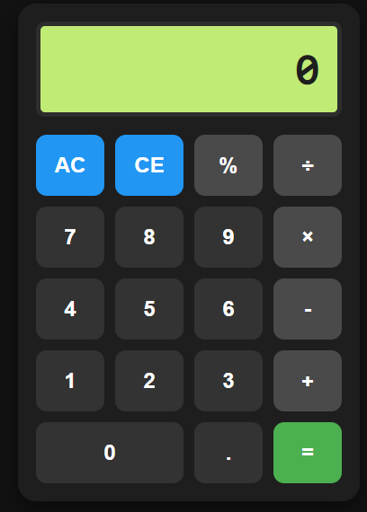

# Django Full-Stack Calculator

### Project Screenshot

### About Project
Hey! This is a simple full-stack calculator project I built using Python and the Django framework. I made this to learn how to connect a web frontend with a backend server and handle mathematical logic without using shortcuts like `eval()`. It's a clean, dark-themed web app that looks modern and works great!

### Features
*   **Standard operations**: Addition (+), Subtraction (-), Multiplication (×), Division (÷).
*   **Modulo support**: Calculate remainders using the % operator.
*   **BODMAS Logic**: It follows the correct order of operations (e.g. multiplication before addition).
*   **Single-Page feel**: Uses AJAX so the page doesn't refresh every time you click equal.
*   **AC and CE buttons**: To clear the whole display or just the last character.

### Technologies Used
*   **Python (Django)**: For the backend logic and routing.
*   **HTML & CSS**: For a custom, dark-themed UI without any fancy frameworks.
*   **JavaScript**: To handle button clicks and talk to the Django server.

### Project Structure
*   `calculator_project/`: Main folder for Django settings.
*   `calculator_app/`: The app folder where I wrote the views and logic.
*   `views.py`: Where the calculation requests are processed.
*   `templates/`: Contains the HTML structure.
*   `static/`: Contains the CSS for styling and JS for interactivity.

### How to Run
I've set this up so it's easy to run locally:
1.  Install Django if you haven't already: `pip install django`.
2.  Clone this repository to your machine.
3.  Navigate to the project folder in your terminal.
4.  Run migrations to set up the database: `python manage.py migrate`.
5.  Start the local server: `python manage.py runserver`.
6.  Open your browser and type `http://127.0.0.1:8000/`.

### Error Handling
I included some logic to make sure it doesn't break:
*   **Division by Zero**: Shows "Div By Zero" if you try it.
*   **Invalid Input**: Catches math errors and shows "Invalid Expr".
*   **Clean Numbers**: I made sure useless zeros are removed from the result.

### What I Learned
Building this was a big step for me! I learned how to use Django views to process POST data and how to manage static files like CSS and JS. It was also a good exercise in using stacks to parse math strings manually.

### Future Improvements
*   Add a history section to see past results.
*   Include more advanced functions like square roots.
*   Better mobile responsiveness.

### Author
**Rupesh Kumar Gupta**
A student trying to build cool things with Python and Web Dev.
